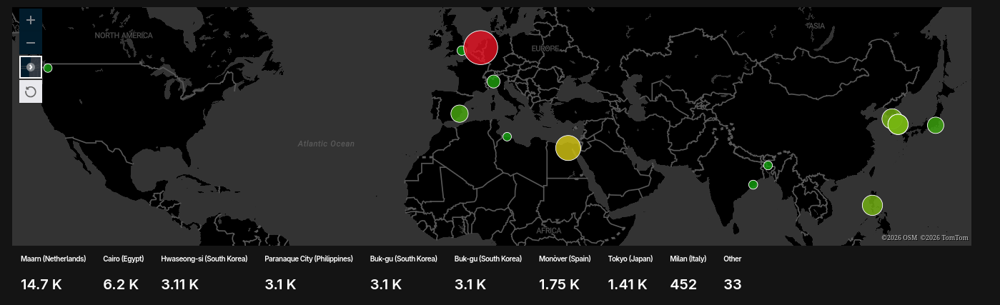
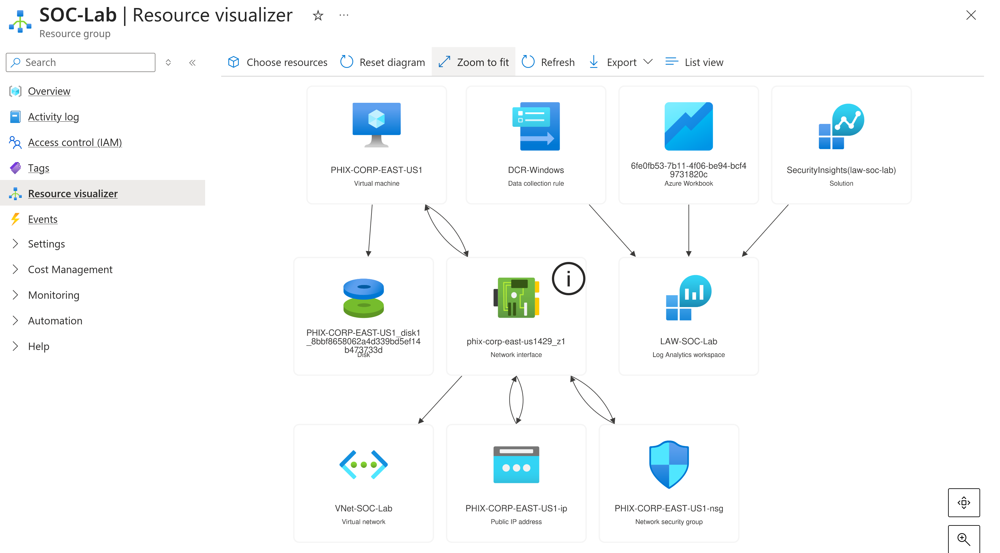

# Azure Honeynet & Cloud SOC Lab


*Live attack map showing real-world brute-force traffic captured over 24 hours*

> **Lab Duration:** ~36 hours exposure (June 10–11, 2026)

## Overview

This project deploys a deliberately exposed Windows 10 virtual machine (VM) on Microsoft Azure as a **honeypot**, which is a decoy system designed to attract real attackers. All attack traffic is forwarded to **Microsoft Sentinel** (a cloud-native SIEM) via a Log Analytics Workspace and **Microsoft Defender**, where I used custom KQL queries to enrich the raw logs with geolocation data and visualize attack origins on an interactive world map.

The goal when making this lab was to simulate a real-world cloud Security Operations Center (SOC) environment, demonstrate end-to-end log ingestion and analysis, and measure the impact of security hardening on attack volume.

### Full Azure Honeynet & Cloud SOC Resouce Group



---

## What I Built

| Component | Purpose |
|---|---|
| Azure Windows 10 VM | Honeypot: intentionally exposed to the internet |
| Network Security Group (NSG) | Configured to allow all inbound traffic (pre-hardening) |
| Windows Defender Firewall | Disabled inside the VM to maximize attack surface |
| Log Analytics Workspace | Central log repository receiving Windows Security Events |
| Azure Monitor Agent (AMA) + DCR | Forwards VM logs to the workspace in real time |
| Microsoft Sentinel | SIEM layered on top — used for KQL queries and dashboards |
| Geolocation Watchlist (67,000 Items) | Maps attacker IP ranges to city and country |
| Sentinel Workbook (Attack Map) | Interactive dashboard visualizing attack origins globally |

---

## Architecture

```
Internet Attackers
        │
        ▼
  Azure VM (Honeypot)
  ┌─────────────────────────────┐
  │  Windows 10                 │
  │  RDP Port 3389 Open         │
  │  Windows Firewall: OFF      │
  │  NSG: Allow All Inbound     │
  └──────────────┬──────────────┘
                 │ Windows Security Events (EventID 4625)
                 ▼
  Log Analytics Workspace (LAW-SOC-Lab)
                 │
                 ▼
  Microsoft Sentinel & Microsoft Defender
  ┌─────────────────────────────┐
  │  KQL Queries                │
  │  Geolocation Enrichment     │
  │  Attack Map Dashboard       │
  └─────────────────────────────┘
```

---

## Key Findings

Over approximately **24 hours** of exposure, the honeypot captured:

- **20,358 failed RDP authentication attempts** (EventID 4625)
- **Peak rate of ~2,600 attempts per hour** at maximum attack volume
- **Attack sources across 9 countries on 4 continents**

### Top Attack Sources

| City | Country | Attempts |
|---|---|---|
| Maarn | Netherlands | 14,700 |
| Cairo | Egypt | 6,200 |
| Buk-gu | South Korea | 6,200 |
| Paranaque City | Philippines | 3,100 |
| Monòver | Spain | 1,750 |
| Tokyo | Japan | 1,410 |
| Milan | Italy | 452 |
| Other | Various | 33 |

> **Note:** Attack sources reflect botnet infrastructure locations, not necessarily the physical location of attackers. The Netherlands is a known hub for European botnet hosting due to cheap VPS infrastructure and high-bandwidth networks.

---

## KQL Queries

### 1. All Failed Logon Attempts
```kql
SecurityEvent
| where EventID == 4625
```

### 2. Top Attacking IPs by Volume
```kql
SecurityEvent
| where EventID == 4625
| where IpAddress != "-"
| summarize count() by IpAddress
| order by count_ desc
```

### 3. Geo-Enriched Attack Data
```kql
let GeoIPDB = _GetWatchlist("geoip");
let WindowsEvents = SecurityEvent
    | where EventID == 4625
    | where IpAddress != "-"
    | order by TimeGenerated desc
    | evaluate ipv4_lookup(GeoIPDB, IpAddress, network);
WindowsEvents
| project TimeGenerated, Account, IpAddress, city = cityname, country = countryname
```

### 4. Attacker Leaderboard with Geolocation
```kql
let GeoIPDB = _GetWatchlist("geoip");
SecurityEvent
| where EventID == 4625
| where IpAddress != "-"
| summarize count() by IpAddress
| order by count_ desc
| evaluate ipv4_lookup(GeoIPDB, IpAddress, network)
| project IpAddress, count_, cityname, countryname
```

### 5. Hourly Attack Volume (Before/After Hardening)
```kql
SecurityEvent
| where EventID == 4625
| summarize count() by bin(TimeGenerated, 1h)
| order by TimeGenerated desc
```

---

## Security Hardening & Results

After collecting 24 hours of baseline attack data, the environment was hardened:

**Changes made:**
- NSG rule updated to allow RDP (port 3389) from **my IP address only** — all other inbound traffic denied
- Windows Defender Firewall re-enabled on all profiles (Domain, Private, Public)

## Metrics Before Hardening

The following metrics were measured over a 24-hour period with the environment fully exposed:

| Start Time | 2026-06-10 ~8:00 PM EST |
| Stop Time  | 2026-06-11 ~4:00 PM EST |

| Metric | Count |
|---|---|
| Failed RDP Logons (EventID 4625) | 20,358 |
| Peak Hourly Attack Rate | ~2,600 |
| Unique Attacking IPs | 13 |
| Countries of Origin | 9 |

---

## Metrics After Hardening

The following metrics were measured over a 2-hour window after security controls were applied:

| Start Time | 2026-06-11 ~4:00 PM EST |
| Stop Time  | 2026-06-11 ~6:00 PM EST |

| Metric | Count |
|---|---|
| Failed RDP Logons (EventID 4625) | 0 |
| Peak Hourly Attack Rate | 0 |
| Unique Attacking IPs | 0 |

**Security controls applied:**
- NSG restricted to single trusted source IP (port 3389 only)
- Windows Defender Firewall re-enabled on all profiles (Domain, Private, Public)

> All attack map queries returned no results following hardening, demonstrating complete elimination of external brute-force traffic.

---

## Log Pipeline

Windows Security Events are forwarded from the VM to the Log Analytics Workspace using:
- **Azure Monitor Agent (AMA)** — installed on the VM via the Sentinel data connector
- **Data Collection Rule (DCR-Windows)** — defines which events to collect (Security Event logs) and where to send them (Azure Monitor Logs)

This is the same log forwarding architecture used in production Azure SOC environments.

---

## Screenshots
| Screenshot | Description |
|---|---|
| `screenshots/attack-map.png` | Final attack map with global attack origins |
| `screenshots/nsg-before.png` | NSG rules before hardening (all traffic allowed) |
| `screenshots/nsg-after.png` | NSG rules after hardening (my IP only) |
| `screenshots/firewall-off.png` | Windows Firewall disabled (pre-hardening) |
| `screenshots/firewall-on.png` | Windows Firewall re-enabled (post-hardening) |
| `screenshots/kql-raw-4625.png` | Raw EventID 4625 query — 20,358 failed logon events |
| `screenshots/kql-leaderboard.png` | Top attacking IPs by volume (no geo enrichment) |
| `screenshots/kql-geo-leaderboard.png` | Top attacking IPs with city and country enrichment |
| `screenshots/kql-geo-enriched.png` | Full geo-enriched event stream with timestamp and account |
| `screenshots/hourly-drop.png` | Hourly attack volume showing drop to zero post-hardening |
| `screenshots/dcr.png` | Data Collection Rule configuration |
| `screenshots/watchlist.png` | Geolocation watchlist (67,000 items) |
| `screenshots/ingestion-chart.png` | Log Analytics ingestion volume over time |

---

## Technologies Used

- Microsoft Azure (Virtual Machines, NSG, VNet, Log Analytics Workspace)
- Microsoft Sentinel (SIEM — Workbooks, Watchlists, Analytics)
- Microsoft Defender for Cloud (Watchlist and Workbook management)
- KQL (Kusto Query Language)
- Azure Monitor Agent (AMA) + Data Collection Rules (DCR)
- Windows 10, Windows Defender Firewall, Remote Desktop Protocol (RDP)
- Remmina (RDP client on Fedora Linux)

---

## What I Learned

- How to architect and deploy a cloud-based threat detection pipeline from scratch on Azure
- How NSG rules and host-based firewalls work together as layered defenses and what happens when both are removed
- How to write KQL queries to filter, aggregate, and enrich security event data
- How to join a geolocation watchlist to raw log data using `ipv4_lookup` to derive threat intelligence from IP addresses
- How to build an interactive attack map dashboard in Sentinel Workbooks
- That automated bots begin attacking exposed RDP ports within minutes of VM deployment and that the Netherlands, Egypt, and South Korea are among the most active sources of botnet infrastructure
- How log ingestion pipelines work in a real SIEM (AMA → DCR → Log Analytics → Sentinel & Defender)

---

## Next Steps

- Add Sentinel Analytics Rules to automatically generate incidents from high-volume attack patterns
- Implement Azure Active Directory / Entra ID integration for identity-based detection
- Expand to a second VM on Linux to capture SSH brute-force attempts for comparison
- Explore Microsoft Defender for Cloud's Secure Score to identify and remediate additional misconfigurations

---

## References

### Microsoft Documentation
- [Microsoft Sentinel Documentation](https://learn.microsoft.com/en-us/azure/sentinel/)
- [Azure Network Security Groups](https://learn.microsoft.com/en-us/azure/virtual-network/network-security-groups-overview)
- [Azure Monitor Agent Overview](https://learn.microsoft.com/en-us/azure/azure-monitor/agents/azure-monitor-agent-overview)
- [Data Collection Rules in Azure Monitor](https://learn.microsoft.com/en-us/azure/azure-monitor/essentials/data-collection-rule-overview)
- [Windows Security Event ID Reference](https://learn.microsoft.com/en-us/windows/security/threat-protection/auditing/event-4625)
- [Microsoft Sentinel Workbooks](https://learn.microsoft.com/en-us/azure/sentinel/monitor-your-data)
- [Sentinel Watchlists](https://learn.microsoft.com/en-us/azure/sentinel/watchlists)

### KQL
- [KQL Quick Reference](https://learn.microsoft.com/en-us/azure/data-explorer/kql-quick-reference)
- [ipv4_lookup() operator](https://learn.microsoft.com/en-us/azure/data-explorer/kusto/query/ipv4-lookup-plugin)
- [summarize operator](https://learn.microsoft.com/en-us/azure/data-explorer/kusto/query/summarize-operator)
- [Free KQL Practice — KC7 Cyber](https://kc7cyber.com/)

### Security Concepts
- [MITRE ATT&CK — Brute Force (T1110)](https://attack.mitre.org/techniques/T1110/)
- [What is a Honeypot? — Cloudflare](https://www.cloudflare.com/learning/security/glossary/what-is-a-honeypot/)
- [Windows Event ID 4625 — Failed Logon](https://www.ultimatewindowssecurity.com/securitylog/encyclopedia/event.aspx?eventid=4625)
- [Geolocation Watchlist Source GitHub](https://raw.githubusercontent.com/joshmadakor1/lognpacific-public/refs/heads/main/misc/geoip-summarized.csv)
